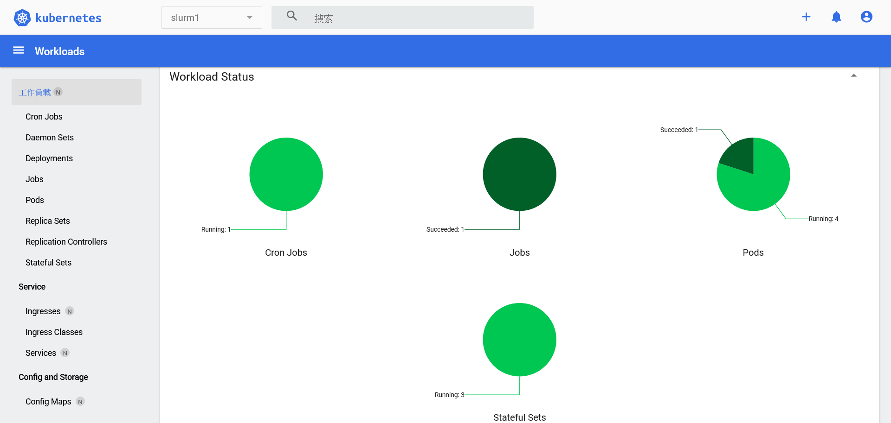
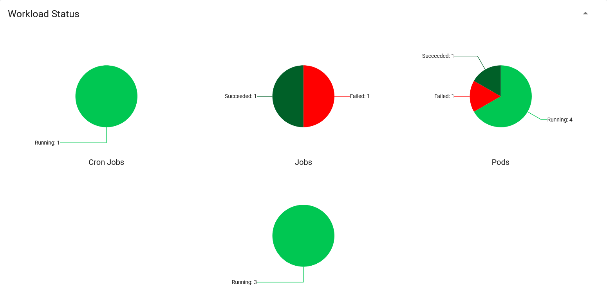
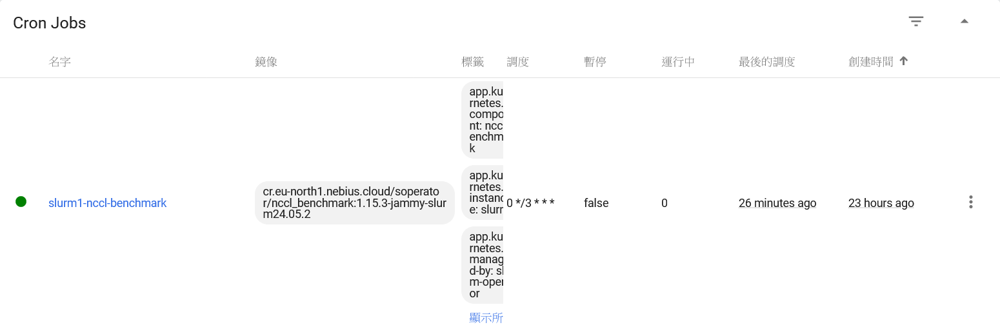
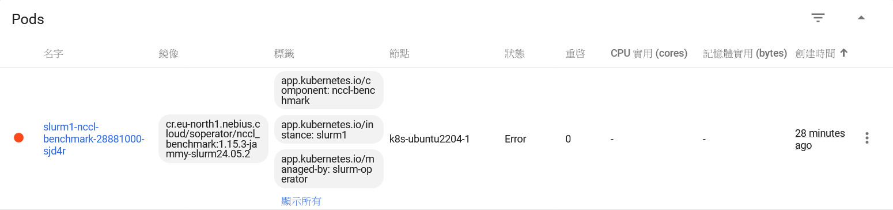

# NOTES by MyelinTek

- base:
  - tag: `1.15.3`

## Pre-requisites

1. Kubernetes cluster available.
   1. At least a CPU-only node out of GPU Operator and at least a GPU node within GPU Operator.
   1. Network plugin: `calico` (Kubespray default)
   1. kube-proxy mode: `ipvs` (Kubespray default) -> `iptables`
   1. `local-path` storage class is available, needed in creating worker PVs.
1. NFS service available, needed in creating some PVs.
1. `cr.myelintek.com/soperator/slurm-operator:1.15.3-p3` is available, which has be built as follows
   ```bash
   docker build -t cr.myelintek.com/soperator/slurm-operator:1.15.3-p3 .
   ```



## Limitations

Inherited from soperator:

1. No AMD GPU support.
1. Single-partition clusters.
1. The list of software versions we currently support is quite short:
   - Linux: Ubuntu 20.04 and 22.04.
   - Slurm: versions 23.11.6 and 24.05.3.
   - CUDA: version 12.2.2.
   - Kubernetes: >= 1.28.
   - Versions of some preinstalled software packages can't be changed.

Specific to our deployment:

1. No accounting support.
1. Single-controller only.
1. Routing configuration may be slower due to kube-proxy operating in `iptables` mode.
   > soperator is well tesed with the `cilium` network plugin and kube-proxy replated by `cilium`, where the performance is exptected better.
1. The nccl benchmark cronjab may fail due to insufficient node resources.
   ```console
   Link users from jail
   Bind-mount slurm configs from K8S config map
   Bind-mount munge key from K8S secret
   Starting munge
   Waiting until munge started
   Start NCCL test benchmark
   1 GPUs on each node are going to be benchmarked
   srun: error: CPU count per node can not be satisfied
   srun: error: Unable to allocate resources: Requested node configuration is not available
   srun: error: CPU count per node can not be satisfied
   srun: error: Unable to allocate resources: Requested node configuration is not available
   All exit codes not 0 - 1
   1
   ```
   
   
   

## Deployment

1. Install the soperator.
   ```bash
   cd $repo/helm/soperator
   helm -n soperator install --create-namespace -f values.yaml soperator .
   ```
1. Prepare resources needed by the slurm cluster.
   - The slurm cluster will be installed in the `slurm1` namespace. To install the slurm cluster in another namespace:
     - Add the `-n $another_namespace` argument in ALL preceding kubectl and helm commands.
     - Change the value of `clusterName` in `helm/slurm-cluster/values.yaml`.
   ```bash
   cd $repo/deployment
   kubectl apply -f cluster.yaml
   kubectl apply -f secrets.yaml
   ```
1. Install the slurm cluster.
   ```bash
   cd $repo/helm/slurm-cluster
   helm -n slurm1 install -f values.yaml slurm .
   ```
   > It takes long time to pull images. All the pods should be ready or completed after a while.

To log in to the Slurm service:

1. Create port forwarding (due to VPN restrictions).
   ```bash
   kubectl -n slurm1 port-forward svc/slurm1-login-svc 8022:22
   ```
1. Access with SSH on the host machine.
   ```console
   $ ssh -p 8022 -i $repo/deployment/id_soperator root@localhost
   Welcome to Ubuntu 22.04.5 LTS (GNU/Linux 5.15.0-91-generic x86_64)
   
    * Documentation:  https://help.ubuntu.com
    * Management:     https://landscape.canonical.com
    * Support:        https://ubuntu.com/pro
   
   This system has been minimized by removing packages and content that are
   not required on a system that users do not log into.
   
   To restore this content, you can run the 'unminimize' command.
   
   The programs included with the Ubuntu system are free software;
   the exact distribution terms for each program are described in the
   individual files in /usr/share/doc/*/copyright.
   
   Ubuntu comes with ABSOLUTELY NO WARRANTY, to the extent permitted by
   applicable law.
   
   root@login-0:~# sinfo
   PARTITION AVAIL  TIMELIMIT  NODES  STATE NODELIST
   main*        up   infinite      2   idle worker-[0-1]
   root@login-0:~# srun -N 1 -p main --pty /bin/bash
   root@worker-1:~# module available
   bash: module: command not found
   root@worker-1:~# nvidia-smi
   Thu Nov 28 08:22:51 2024
   +-----------------------------------------------------------------------------------------+
   | NVIDIA-SMI 550.127.05             Driver Version: 550.127.05     CUDA Version: 12.4     |
   |-----------------------------------------+------------------------+----------------------+
   | GPU  Name                 Persistence-M | Bus-Id          Disp.A | Volatile Uncorr. ECC |
   | Fan  Temp   Perf          Pwr:Usage/Cap |           Memory-Usage | GPU-Util  Compute M. |
   |                                         |                        |               MIG M. |
   |=========================================+========================+======================|
   |   0  NVIDIA GeForce RTX 2080 Ti     On  |   00000000:00:08.0 Off |                  N/A |
   | 27%   30C    P8             14W /  260W |       1MiB /  11264MiB |      0%      Default |
   |                                         |                        |                  N/A |
   +-----------------------------------------+------------------------+----------------------+
   
   +-----------------------------------------------------------------------------------------+
   | Processes:                                                                              |
   |  GPU   GI   CI        PID   Type   Process name                              GPU Memory |
   |        ID   ID                                                               Usage      |
   |=========================================================================================|
   |  No running processes found                                                             |
   +-----------------------------------------------------------------------------------------+
   root@worker-1:~#
   exit
   root@login-0:~# scontrol show node worker-0
   NodeName=worker-0 Arch=x86_64 CoresPerSocket=1
      CPUAlloc=0 CPUEfctv=10 CPUTot=10 CPULoad=0.92
      AvailableFeatures=(null)
      ActiveFeatures=(null)
      Gres=gpu:nvidia_geforce_rtx_2080_ti:1(S:0-9)
      NodeAddr=10.233.83.7 NodeHostName=worker-0 Version=24.05.2
      OS=Linux 5.15.0-91-generic #101-Ubuntu SMP Tue Nov 14 13:30:08 UTC 2023
      RealMemory=15708 AllocMem=0 FreeMem=467 Sockets=10 Boards=1
      State=IDLE+DYNAMIC_NORM ThreadsPerCore=1 TmpDisk=0 Weight=1 Owner=N/A MCS_label=N/A
      Partitions=main
      BootTime=2024-11-27T07:27:26 SlurmdStartTime=2024-11-28T06:33:33
      LastBusyTime=2024-11-28T02:10:39 ResumeAfterTime=None
      CfgTRES=cpu=10,mem=15708M,billing=10
      AllocTRES=
      CurrentWatts=0 AveWatts=0
   ```

Example: resnet inference

1. Access with SSH on the host machine.
1. Download the container image.
   - The `nvcr.io/nvidia/tensorflow:23.03-tf1-py3` image in the Taipei-1 tutorial has OpenMPI 4.1.4, which embeds PMIxv3 client and cannot recognize the PMIxv5 environment in our deployed Slurm cluster. We use the currently latest `nvcr.io/nvidia/tensorflow:24.11-tf2-py3` image instead.
     > Issue: OMPI v4.x fails when built against PMIx v5: https://github.com/open-mpi/ompi/issues/10307
   - We used a custom tmp directory at `/root/mytmp`, sinche the default `/tmp` directory has only ~8GB in size, which is issuficient for extraction during image saving.
   ```console
   root@login-0:~# mkdir -p ~/mytmp
   root@login-0:~# TMPDIR=~/mytmp srun --ntasks=1 -p main --container-image nvcr.io#nvidia/tensorflow:24.11-tf2-py3 --container-save ./tf2411.sqsh true
   pyxis: importing docker image: nvcr.io#nvidia/tensorflow:24.11-tf2-py3
   pyxis: imported docker image: nvcr.io#nvidia/tensorflow:24.11-tf2-py3
   pyxis: exported container pyxis_8.0 to ./tf2411.sqsh
   ```
1. Run single-node inference.
   ```console
   root@login-0:~# srun -N 1 -p main --exclusive --mpi=pmix_v5 --gres=gpu:1 --ntasks-per-node 1 --container-image ~/tf2411.sqsh --container-writable python /workspace/nvidia-examples/cnn/resnet.py -b 32 -i 100
   ... skip hundurends of lines of messages ...
   global_step: 10 images_per_sec: 8.0
   global_step: 20 images_per_sec: 621.2
   global_step: 30 images_per_sec: 624.1
   global_step: 40 images_per_sec: 632.1
   global_step: 50 images_per_sec: 637.1
   global_step: 60 images_per_sec: 635.2
   global_step: 70 images_per_sec: 632.2
   global_step: 80 images_per_sec: 624.2
   global_step: 90 images_per_sec: 632.7
   global_step: 100 images_per_sec: 633.4
   epoch: 0 time_taken: 44.4
   100/100 - 44s - loss: 11.5346 - top1: 0.2256 - top5: 0.2819 - 44s/epoch - 444ms/step
   ```
1. Run multi-node inference.
   ```console
   root@login-0:~# srun -N 2 -p main --exclusive --mpi=pmix_v5 --gres=gpu:1 --ntasks-per-node 1 --container-image ~/tf2411.sqsh --container-writable python /workspace/nvidia-examples/cnn/resnet.py -b 64 -i 100
   ...
   global_step: 10 images_per_sec: 13.7
   global_step: 20 images_per_sec: 114.1
   global_step: 30 images_per_sec: 115.5
   global_step: 40 images_per_sec: 119.9
   global_step: 50 images_per_sec: 112.1
   global_step: 60 images_per_sec: 113.7
   global_step: 70 images_per_sec: 108.5
   global_step: 80 images_per_sec: 101.2
   global_step: 90 images_per_sec: 110.6
   global_step: 100 images_per_sec: 105.9
   epoch: 0 time_taken: 197.0
   100/100 - 197s - loss: 11.1287 - top1: 0.4095 - top5: 0.4917 - 197s/epoch - 2s/step
   ```

## Changes

1. deployment
   1. helm/slurm-cluster/values.yaml
      - Create NFS-based PVs/PVCs needed by jail and controller-spool in slurm-cluster (we need PVCs across nodes).
   1. deployment/secrets.yaml
      - Create the `slurm1-slurmdbd-configs` secret manually, which soperator should create but it doesn't.
        > https://github.com/nebius/soperator/issues/203
   1. deployment/id\_soperator and deployment/id\_soperator.pub
      - A self-generated key pair for accessing the login service.
1. soperator
   1. helm/soperator/templates/deployment.yaml
      - Add node selector.
   1. helm/soperator/values.yaml
      - Replace the operator image from `cr.eu-north1.nebius.cloud/soperator/slurm-operator:1.15.3` to `cr.myelintek.com/soperator/slurm-operator:1.15.3-p3`.
        - We built an operator image to fix bugs (see the next item).
          > https://github.com/nebius/soperator/issues/204
   1. internal/render/login/configmap.go
      - Remove `MaxStartups` and `LoginGraceTime` from sshd config.
        ```
        /mnt/ssh-configs/sshd_config line 18: Directive 'MaxStartups' is not allowed within a Match block
        ```
        Likewise for 'LoginGraceTime'.
      - Add a space between `MaxAuthTries` and `consts.SSHDMaxAuthTries`.
1. slurm-cluster
   1. helm/slurm-cluster/values.yaml
      - Replace gpu/non-gpu node matching label from `nebius.com/node-group-id` to `nvidia.com/gpu.present`.
      - Disable accounting in slurm nodes.
        - *accounting* pod or svc are not created by soperator, which fails the *controller-0* pod.
      - Decrease controller size from 2 to 1.
        - Bi-controller deployment does not work as expected.
          - *controller-0* pod fails to resolve `controller-1.slurm1-controller-svc.slurm1.svc.cluster.local` (since *controller-1* pod has not been running) and `slurm1-accounting-svc` (such a svc does not exist, fixed by disabling accounting).
            ```
            slurmctld: error: xgetaddrinfo: getaddrinfo(controller-1.slurm1-controller-svc.slurm1.svc.cluster.local:6817) failed: Name or service not known
            slurmctld: error: slurm_set_addr: Unable to resolve "controller-1.slurm1-controller-svc.slurm1.svc.cluster.local"
            slurmctld: debug:  Requesting control from backup controller controller-1
            slurmctld: error: slurm_get_port: Address family '0' not supported
            slurmctld: error: Error connecting, bad data: family = 0, port = 0
            slurmctld: error: _shutdown_bu_thread:send/recv controller-1: No error
            slurmctld: error: xgetaddrinfo: getaddrinfo(slurm1-accounting-svc:6819) failed: Name or service not known
            slurmctld: error: slurm_set_addr: Unable to resolve "slurm1-accounting-svc"
            slurmctld: error: slurm_get_port: Address family '0' not supported
            slurmctld: error: Error connecting, bad data: family = 0, port = 0
            slurmctld: error: _open_persist_conn: failed to open persistent connection to host:slurm1-accounting-svc:6819: No error
            slurmctld: error: Sending PersistInit msg: No error
            slurmctld: accounting_storage/slurmdbd: clusteracct_storage_p_register_ctld: Registering slurmctld at port 6817 with slurmdbd
            slurmctld: error: xgetaddrinfo: getaddrinfo(slurm1-accounting-svc:6819) failed: Name or service not known
            slurmctld: error: slurm_set_addr: Unable to resolve "slurm1-accounting-svc"
            slurmctld: error: slurm_get_port: Address family '0' not supported
            slurmctld: error: Error connecting, bad data: family = 0, port = 0
            slurmctld: error: Sending PersistInit msg: No such file or directory
            ```
          - *controller-1- pod stuck at waiting for heartbeat.
            ```
            slurmctld: debug:  get_last_heartbeat: sleeping before attempt 1 to open heartbeat
            slurmctld: debug:  get_last_heartbeat: sleeping before attempt 2 to open heartbeat
            slurmctld: error: get_last_heartbeat: heartbeat open attempt failed from /var/spool/slurmctld/heartbeat.
            slurmctld: warning: Waiting for heartbeat file to exist...
            ```
      - Decrease the resource requests from the *slurmctld* and *munge* containers in *worker* pods (insufficient node resources).
      - Replace the storage class of PVs/PVCs for *worker-spool* from `nebius-network-ssd` to `local-path` and decrease the requested volume size (insufficient node resources).
      - Decrease the login size from 2 to 1 (insufficient node resources).
      - Add a record in `sshRootPublicKeys` to add an authorized key.
